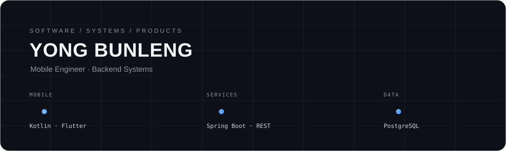

  

  <strong>Mobile Engineer · Backend Systems · Product Engineering</strong>

  Building reliable software from interface to infrastructure.

  <a href="https://yong-bunleng.vercel.app/">Portfolio</a>
  ·
  <a href="https://www.linkedin.com/in/yong-bunleng-ybl369/">LinkedIn</a>
  ·
  <a href="mailto:yong.bunleng.cs@gmail.com">Email</a>

---

## About

I build software across the full product stack — from mobile interfaces and
application architecture to backend services and databases.

My focus is on systems that are:

- maintainable as they grow
- predictable under real usage
- performant without unnecessary complexity
- designed around actual product needs

Currently working as a **Mobile Engineer at VTS Logistics & Freight Forwarder**.

---

## Engineering Stack

<table>
<tr>
<td width="25%" valign="top">

### Mobile

Kotlin  
Jetpack Compose  
Android SDK  

</td>
<td width="25%" valign="top">

### Backend

Spring Boot  
REST APIs  
Spring Security  
JWT  

</td>
<td width="25%" valign="top">

### Data

PostgreSQL  
SQL Server  

</td>
<td width="25%" valign="top">

### Platform

Docker  
Firebase  
Git  

</td>
</tr>
</table>

---

## Selected Work

### 01 — Expense Tracker

**Native Android expense management application**

Kotlin · Jetpack Compose · MVVM

Built around state-driven UI and maintainable Android application architecture.

[View project →](https://github.com/DrRaspec/My-Expense-Tracker-with-Kotlin)

---

### 02 — Rice Disease Detection

**Image classification system for rice leaf diseases**

Python · Machine Learning · Image Classification

An ML project exploring computer vision and automated disease detection from
rice leaf images.

[View project →](https://github.com/DrRaspec/rice-leaf-disease-detection)

---

### 03 — Godot Adventure

**Event-driven adventure game**

Godot · Game Systems · Event-Driven Architecture

A game-development project focused on gameplay systems, interaction, and
event-driven design.

[View project →](https://github.com/DrRaspec/Godot-Adventure-Game)

---

### 04 — Todo CLI

**Command-line task manager**

C++ · Data Structures · CLI

A compact systems-oriented project focused on C++ fundamentals and data
structure design.

[View project →](https://github.com/DrRaspec/todo_list_with_cpp)

---

## Current Focus

<table>
<tr>
<td width="33%">

**Building**

Production mobile systems

</td>
<td width="33%">

**Exploring**

Platform integration

</td>
<td width="33%">

**Improving**

System design & scalability

</td>
</tr>
</table>

---

## Principles

> Build the architecture so the next feature stays easy.

I care more about clear boundaries, predictable behavior, and long-term
maintainability than clever abstractions.

---

  systems first. features second.

